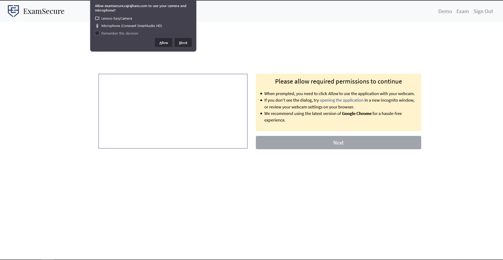
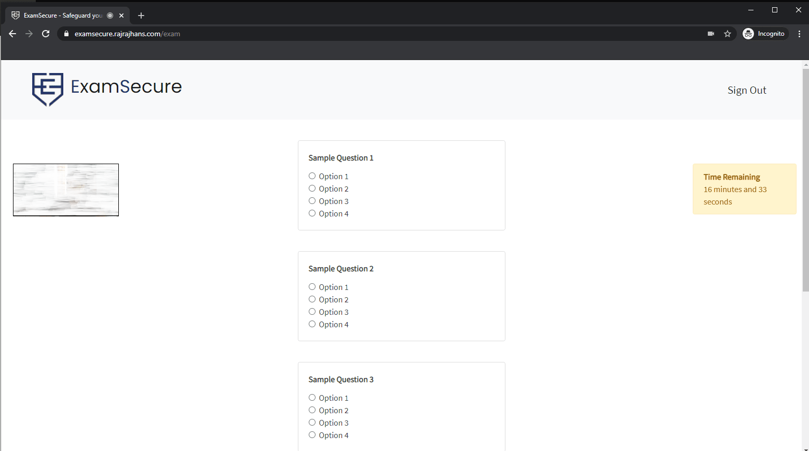
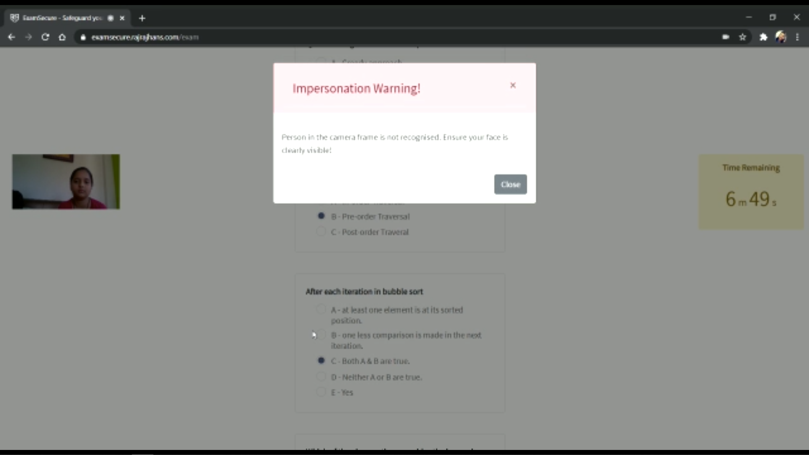
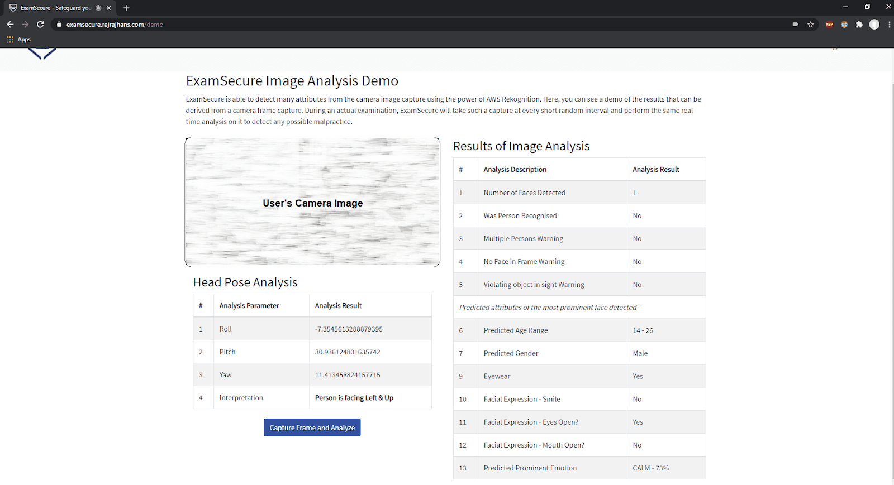
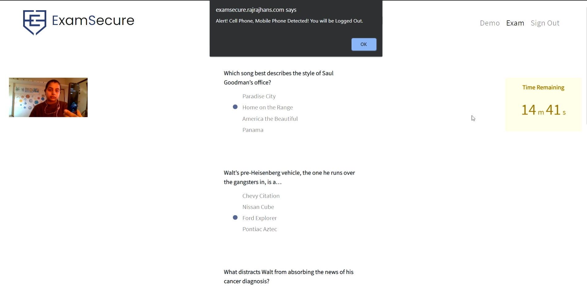
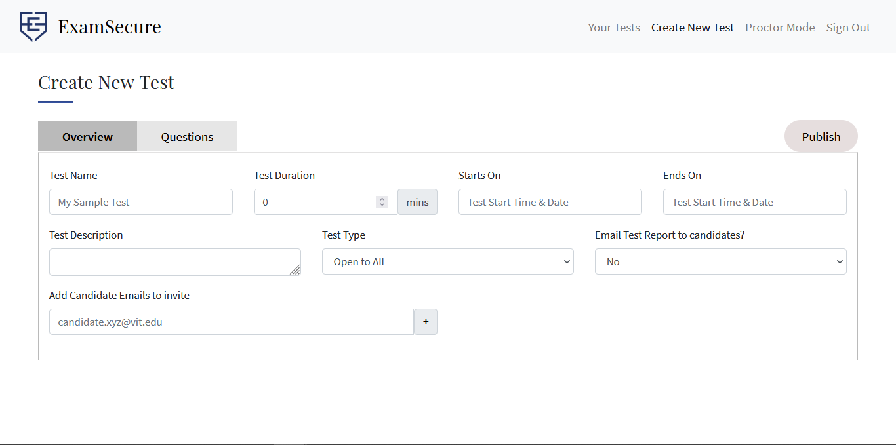
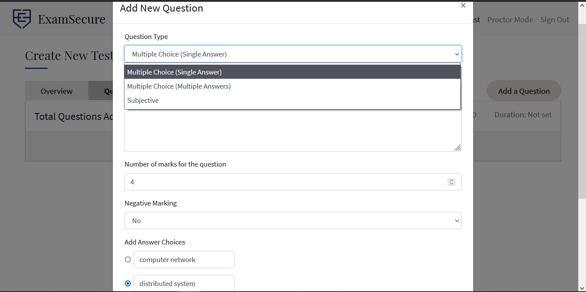
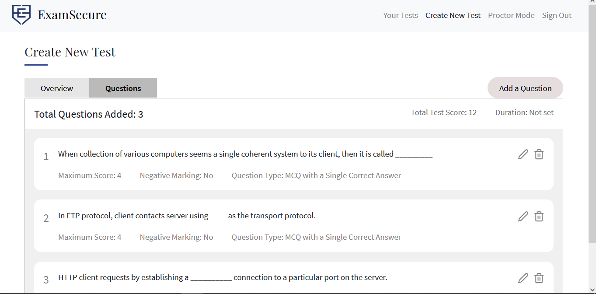
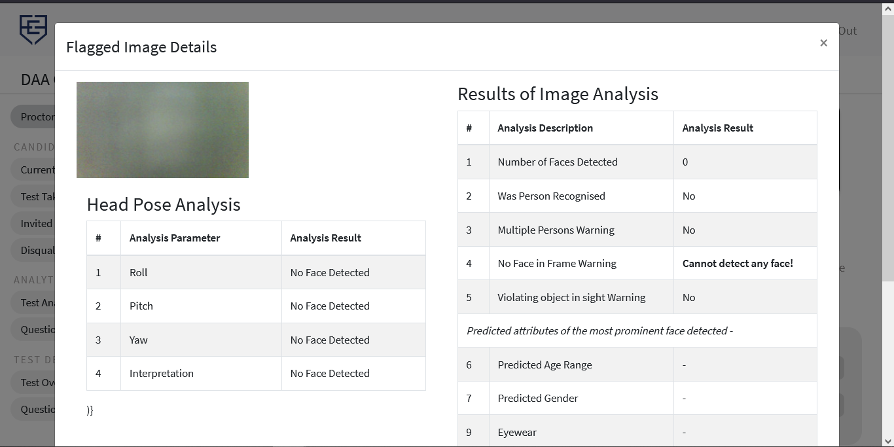

<p align="center">
  <a href="https://examsecure.rajrajhans.com">
    
  </a>
</p>

<h1 align="center">
  ExamSecure
</h1>

<h4 align="center">
  Automated Virtual Proctoring System 
</h4>

ExamSecure is a platform for conducting secure remote examinations and deter candidates from resorting to malpractice. 

## Features

1. **Complete Browser Lockdown**: In the exam environment, ExamSecure completely locks down the candidate's browser, triggering a warning if the candidate tries to switch tabs, open a new window, exit full screen mode or click anywhere else except the Exam screen. Text Selection, Text Copying, and Right Click is also disabled in Exam environment. 

2. **Multiple Persons Detection**: Furthermore, ExamSecure uses the candidate's camera feed to perform advanced image analysis in real time to determine if there are multiple people in the candidate's frame, or if there is no one in the candidate's frame. 

3. **Impersonation Detection**: At the start of the exam, the candidate's face features are saved and if the detected face during the examination do not match the initial face, it triggers an Impersonation Warning. 

4. **Head Pose Estimation**: Using Head Pose estimation, ExamSecure is able to detect the direction in which the candidate is facing and triggers a warning if the candidate is staring away from the screen for long periods of time. This works by using Rekognition to define the human head's rotation in a 3D plane with respect to the camera in terms of the three Euler Angles: Yaw, Pitch and Roll and then using these three angles to determine the direction where the candidate is facing.  

5. **Electronic Objects Detection**: ExamSecure is also able to detect Electronic objects like Mobile Phones, Earphones in the candidate's camera frame and trigger a warning. 

6. **Realtime Monitoring & Disqualification**: Educators can monitor the exam activity via the ExamSecure Educator Interface and can also disqualify candidates if they find any camera frames to be objectionable.

7. **Automatic Test Progress Sync**: ExamSecure automatically syncs the candidate's answers with the server as he/she is attempting the test. The timer is synced as well. So, if there is a loss of connectivity in between, the candidate can continue from where he left off.

... and many more features to be added soon, including detailed test and question level analytics for the educators!

ExamSecure uses the [AWS Rekognition](https://aws.amazon.com/rekognition/) API for Object Detection, Person Detection, and Face Analysis.

Note: ExamSecure is currently a **Work In Progress**. It is deployed [here](https://examsecure.rajrajhans.com) but only authorized test candidates are given access. If you want to test it, please follow [these steps](https://github.com/rajrajhans/examsecure#running-examsecure-locally) to run ExamSecure locally.

## Screenshots

Following is a sneak peek of how the interface looks.

### ExamSecure Candidate Interface

| Home,  Log In                              | Allow Camera Permissions                             |
| ------------------------------------ | ------------------------------------ |
|  |  |

| Pre-Exam Instructions                              | Exam Interface                             |
| ------------------------------------ | ------------------------------------ |
|  |  |

| Impersonation Warning                             | Image Analysis Demo                             |
| ------------------------------------ | ------------------------------------ |
|  |  |

| Mobile Detected                             | Force Logout                             |
| ------------------------------------ | ------------------------------------ |
|  |  |

For more, check out the [Demo Videos page](https://examsecure.rajrajhans.com/demoVideos), and [the Image Analysis Demo](https://examsecure.rajrajhans.com/demo)

### ExamSecure Educator Interface

| Educator Dashboard                              | Create New Test                             |
| ------------------------------------ | ------------------------------------ |
|  |  |

| Add Questions                              | View, Edit, Delete Added Questions                             |
| ------------------------------------ | ------------------------------------ |
|  |  |

| Realtime Proctor Mode                             | Candidate Camera Capture Image Analysis                             |
| ------------------------------------ | ------------------------------------ |
|  |  |

## Codebase Organization

The codebase is organized following the [monorepo architecture](https://www.toptal.com/front-end/guide-to-monorepos). It uses [Yarn Workspaces](https://classic.yarnpkg.com/en/docs/workspaces/) and [Lerna](https://lerna.js.org/) for managing the monorepo. The monorepo currently has three packages 

- [`@examsecure/candidate-app`](packages/examsecure-candidate-app): React webapp for the candidate portal. It was created using Create React App, but is now [ejected](https://create-react-app.dev/docs/available-scripts/#npm-run-eject) to support custom Babel config for monorepo architecture. 
- [`@examsecure/educator-app`](packages/examsecure-educator-app): React webapp for the educator portal. 
- [`@examsecure/design-system`](packages/examsecure-design-system): A simple design system for shared UI components between both webapps. Created using [Storybook](https://storybook.js.org/).

### The CI/CD pipeline

Following tasks are run on every PR against `master`.
- Build code and run tests for all three packages through [a Github Actions workflow](https://github.com/rajrajhans/examsecure/tree/master/.github/workflows). Since the project uses Lerna, it's easy to build and test all the packages in one single command. 
- Upload test coverage to [codecov](https://about.codecov.io/).
- Deploy each React app separately using [Netlify Deploy Previews](https://www.netlify.com/blog/2016/07/20/introducing-deploy-previews-in-netlify/). So, there will be three Netlify deploy previews, one each for the candidate app, educator app, and StoryBook design system.
- Continuous Security Analysis and Automated Code Reviews using [LGTM.com](https://lgtm.com/).

## What's next?

These are the things I plan to work on next on ExamSecure 👉🏻
- Work on having good unit tests for the codebase.
- Work on the Educator interface for scheduling and monitoring exams, and aggregating results once the Exam is over into relevant reports.
  - Here's the [Figma Prototype](https://www.figma.com/proto/RIsibmqXUtjutPBGPilQKq/Home?node-id=1%3A12&scaling=min-zoom) for the educator interface that I'm currently working on.
- Optimise the code that runs on Lambda functions.

## Running ExamSecure Locally

Note: Running this project will require you to set up and configure 
the required AWS resources.

1. Clone the project.
2. Run `npm install` to install all required dependencies.
3. Configure AWS and put required details in `public/settings.js`.
4. Run `npm start`.

The project should run now. In case of any error, make sure your AWS configuration is correct. 

## AWS Configuration

This project uses many AWS services - S3, CloudFront, Rekognition, Lambda, Cognito, DynamoDB, API Gateway, and CodePipeline. To make the configuration process easy, a CloudFormation stack template is provided. All you need to deploy that template and CloudFormation will take care of the rest!

- First, you need to make a S3 bucket which contains the build files of the React app. Follow [this documentation by AWS](https://docs.aws.amazon.com/AmazonS3/latest/user-guide/create-bucket.html) for more details.
    - To get the build files, run `npm run build`. Build files will be `/build`
    
- Now that you have the S3 bucket details, you need to create a CloudFormation stack which will manage all the resources we need. I have provided the stack template at `cloudformation/template.yaml` in this repository. Follow the steps given [this documentation by AWS](https://docs.aws.amazon.com/AWSCloudFormation/latest/UserGuide/cfn-console-create-stack.html) to deploy this template. During the creation of stack, it will ask you for S3 Bucket URL. You have to provide the URL got in the prior step. 
- Once the Stack Creation process is complete, create a file `settings.js` in your public folder and paste the details from the Clouformation console output in the  following format - 

```javascript
window.rekognitionSettings = {
    "apiGateway": "YOUR_API_GATEWAY",
    "cognitoIdentityPool": "YOUR_COGNITO_IDENTITY_POOL",
    "cognitoUserPoolId": "YOUR_COGNITO_POOLID",
    "cognitoUserPoolClientId": "YOUR_COGNITO_POOL_CLIENDID",
    "region": "YOUR_AWS_REGION"
};
```   

## Challenges & Learnings

- **Increasing Complexity of State Management**: Initially, I used simple React state. However, as I added more and more features, the state management became increasingly complex and I was facing issues like prop drilling on a regular basis. More time was being spent on refactoring components in a way to enable them to share state, than on implementing new features. So, I learned and integrated Redux into the project. The concept of global state store made it easy to add new features. (Although I still use simple React state for managing ephemeral state)
- **Locking Down the Browser**: The requirement was that the user should not be allowed to do anything else while attempting the exam. To implement this, I learned about a lot of DOM APIs for Full Screen, Focus Lost, Context Menu, Text Selection, etc.
- **AWS Rekognition & Lambda**: For the server side, I've used AWS Lamdba along with AWS API Gateway. For real time image analysis, AWS Rekognition is used. This project allowed me to learn a lot about these AWS services and the "serverless" paradigm.
- **Codebase organization**: The candidate portal and the educator portal were being developed separately, although both shared many common UI components, which had to be duplicated in both codebases. After a few months, it became increasingly difficult to maintain duplicate code in both codebases, so I switched to a monorepo architecture using Yarn workspaces and Lerna, and abstracted out the shared components in a separate design system created using Storybook. But, both webapps were created using Create-React-App, and CRA doesn't support importing from outside `src` project root, so I had to eject from CRA in both packages and change the Babel configuration. I learned many things about Webpack and Babel while trying to get this to work. 

## Related Blog Posts
- [Automate Deployment of React apps to AWS S3 using a CD Pipeline](https://rajrajhans.com/2020/08/automate-deployment-react-app-aws/)
- [Using AWS Rekognition, Lambda & API Gateway to build ML Powered WebApps](https://rajrajhans.com/2021/03/image-analyzer-aws-rekognition/)
